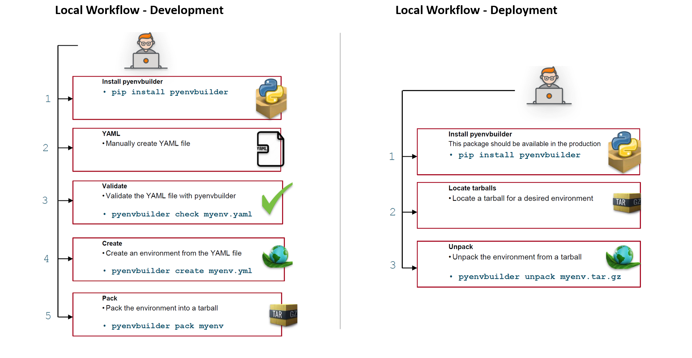

=========================
PyEnvBuilder Walk-through
=========================

Local Workflow - Development
-----------------------------

1. install pyenvbuilder::

	pip install pyenvbuilder

2. create an environment YAML file: *my_env.yml*

Simple YAML file contents example:: 

    name: python3.7env
    version: v0.1
    conda_packages:
            - python=3.7 

3. validate *my_env.yml*::

	pyenvbuilder check my_env.yml

4. create the environment *my_env.yml*::

	pyenvbuilder create my_env.yml
	
   * When creating an environment we also have a few options, for example if we do not have any tests or we do not want to run tests we could use this::
   
  	pyenvbuilder create --skip-tests my_env.yml
  	
   * We could also specify a directory where to create the environment (by default it will create it in the current directory)::
   
  	pyenvbuilder create  --dest my_env.yml

After this we should have an environment called:

	**python3.7env_v0.1**

5. pack the environment::

	pyenvbuilder pack python3.7env_v0.1

   * When packing an environment by default it will remove the acutall environment after packing it, to keep the environment we would have to do this::
    
    	pyenvbuilder pack --keep-env python3.7env_v0.1
    	  

   * We can also provide a destination where we want the tarball to go::
    
  	pyenvbuilder pack  --dest python3.7env_v0.1

This step will pack the environment into a tarball:

	**python3.7env_v0.1.tar.gz**

------------------------------

Local Workflow - Deployment
-----------------------------

1. install pyenvbuilder::

	pip install pyenvbuilder

2. unpack an environenment::

	pyenvbuilder unpack python3.7env_v0.1.tar.gz

After this step you should have an environment called: 

	**python3.7env_v0.1**

To activate the environment run::

	source python3.7env_v0.1/bin/activate

.. note:: You do not need pyenvbuilder to unpack an environment, you can manually do it:
	::

          	mkdir python3.7env_v0.1
      		tar -xzf python3.7env_v0.1.gz -C python3.7env_v0.1
      		source python3.7env_v0.1/bin/activate
      		conda-unpack
      		source python3.7env_v0.1/bin/deactivate

------------------------------

* *Development & Deployment Diagram*

